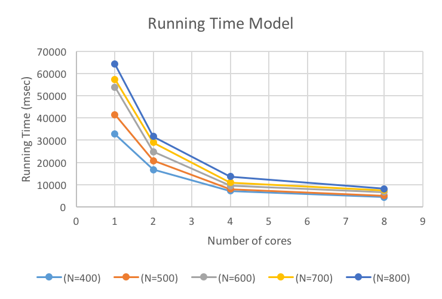

# Subset Sum Problem
##### contributors: 
Alimudin Khan (aak5031@rit.edu) and 
Karan Jariwala (kkj1811@g.rit.edu )
***
### Overview of Subset Sum Problem
* Given a set of positive integers N and a sum S, does there exist a subset
N’ ⊆ N such that sum of all the elements in that subset is S.
* Example:
Suppose we have a set N = { 7, 5, 1, 9, 6, 2} and we are looking for target sum 3
We can easily see that subset {1, 2} has the desired target sum.
* This is very easy to find when given set is small, but as size of set increases the problem
size increases exponentially. A typical Naive implementation of subset sum
problem has time complexity of O(2^n) 
* The subset-sum problem is a well-known non-deterministic polynomial-time complete 
(NPcomplete) decision problem and it is also a special case of 0-1 Knapsack problem.

---
### Algorithm Used:

* We have used **Two-List Algorithm** to solve the subset sum problem efficiently.
* This is so far the best known algorithm to solve subset-sum problem.
* It reduces time complexity to **O(2^(n/2))** from O(2^n).
* A typical Two-list Algorithm' has 2 stages.
 1. Lists Generation Stage
 2. Search Stage
* In our parallel program we are doing data generation stage in parallel.


--- 
### Running the Program
##### STEP 1: Environment Setup
* First of all you need java 1.8 (or higher) and [Java pj2 library](https://www.cs.rit.edu/~ark/pj2.shtml). Java pj2 librarary can be downloaded by 
using this [link](https://www.cs.rit.edu/~ark/pj2.shtml#download).
* You should have pj2 library  avialble in your classpath to ru this program.
* you can use one of the following commands to set you class path based on your linux flavor.

For Bash shell,
			```
			$ export CLASSPATH=.:<path-to-pj2-jar-file>/pj2.jar
			```
			
For csh shell,
			```
			$ setenv CLASSPATH .:<path-to-pj2-jar-file>/pj2.jar
			```

##### Step2: Compile the source code
You can easily compile all source code using standard command as follows;

```
javac *.java
```

##### Step3: Running the program
* To run the sequential version of the program, use the following command;

 ```
Java pj2 SubsetSumSeq <N> <T> <seed> <R>
```
* To run the parallel version of the program, enter the following command;

```
Java pj2 cores=<K> SubsetSumSmp <N> <T> <seed> <R>
```
where,

|Parameter| Details |
| :------: | :-----:|
|<K>| Number of cores|
|<N>| Number of elements in an input set|
|<T>| Target sum|
|<seed>| Random seed to random number generator|
|<R>| Range  of the input numbers to be generated by Random generator|

##### Source file description
Following are source code files and their decription,
|File Name| Description |
| :----:|:----:|
|SubsetSumSeq.java| Solves subset sum problem using sequential two list algorithm |
|SubsetSumSmp.java | Solves subset sum problem using parallel two list algorithm | 
|Functions.java | It has utility functions used by both sequential and parallel programs |
|SubsetSumSeqDemo.java|First two files just print true or false regarding the target sum presence This program will give you detailed output like what was the generated random set, two generated subset sums etc.|

----
### Sample Output

##### Example 1:
Running SubSetSumSeqDemo.java file;
```
java pj2 SubSetSumSeqDemo 10 123 123456 500
```
Above command produces followig output;
```
Input Set: {   96   97  804  438  983  807  523  667  685  447 }

First Half list: {   96   97  804  438  983 }
Second Half list: 
{  807  523  667  685  447 }

Possible subset sum from list1: {0, 96, 97, 193, 438, 534, 535, 631, 804, 900, 901, 983, 997, 1079, 1080, 1176, 1242, 1338, 1339, 1421, 1435, 1517, 1518, 1614, 1787, 1883, 1884, 1980, 2225, 2321, 2322, 2418}
Possible subset sum from list2: {0, 447, 523, 667, 685, 807, 970, 1114, 1132, 1190, 1208, 1254, 1330, 1352, 1474, 1492, 1637, 1655, 1777, 1799, 1875, 1921, 1939, 1997, 2015, 2159, 2322, 2444, 2462, 2606, 2682, 3129}

Target sum: 123
Is Target sum found? false
```
##### Example 2:
Running SubSetSumSeq.java file;
```
java pj2 SubSetSumSeq 10 123 123456 500
```
Above command produces followig output;
```
false
```

##### Example 3 :
Running SubSetSumSmp.java file;
```
java pj2 SubSetSumSmp 10 123 123456 500
```
Above command produces followig output;
```
false
```

### Interacting with program : 
You can use various command line options alongwith pj2 library. We will be using following 2 commands,

|command|Description|
|:----:|:----:|
| debug\=makespan| prints the time taken for execution of the program|
|cores\=n| Tells program to use n cores|
e.g.
```
java pj2 SubSetSumSmp debug=makespan cores=4 10 123 123456 500
```

### Strong Scaling Performance
Follwing graoh shows the scaling performance of the parallel program.


Above graph shows that with increase in number of cores running time decreases accordingly.

### Other Details
To read more about the exact approach used for sequential and parallel program you can read this comprehensive [report](SubsetSum-TeamParallel-Deliverables.pdf).


